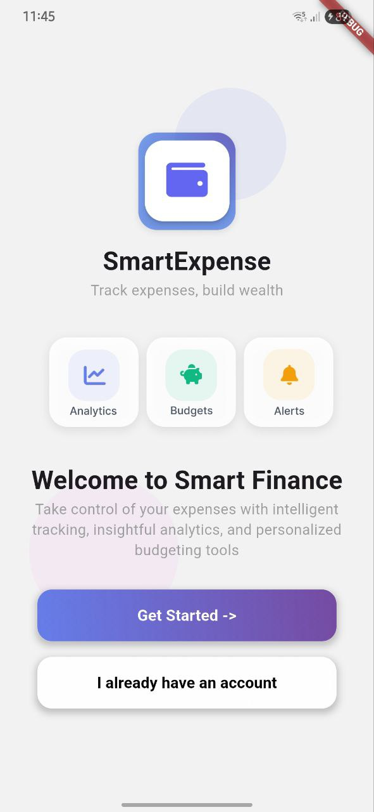

💰 Expense Tracker

A modern, feature-rich Flutter application for tracking personal expenses and managing budgets. Built with Firebase integration, real-time synchronization, and a clean, intuitive UI.

## 📱 Screenshots

### Welcome & Authentication
<p align="center">
  
  
</p>

### Main Features
<p align="center">
  
  
  
  
</p>

### Budget & Settings
<p align="center">
  
  
</p>

## ✨ Features

### 🔐 Authentication
- Email/Password authentication
- Google Sign-In integration
- Password reset functionality
- Secure user profile management

### 💸 Transaction Management
- Add income and expense transactions
- Categorize transactions with custom categories
- Filter by date, category, and type
- Real-time transaction updates
- Detailed transaction history

### 📊 Budget Tracking
- Set monthly budgets per category
- Visual progress indicators
- Budget overspending alerts
- Automatic spending calculation
- Total budget overview

### 📈 Statistics & Analytics
- Visual expense breakdown by category
- Income vs. Expense tracking
- Monthly financial summaries
- Interactive charts and graphs

### ⚙️ Customizable Settings
- Profile management with avatar upload
- Multi-currency support
- Password change functionality
- Theme customization
- Notification preferences
- Data synchronization controls

## 🛠️ Technologies Used

### Frontend
- **Flutter** - Cross-platform UI framework
- **Provider** - State management solution
- **Phosphor Icons** - Modern icon library
- **FL Chart** - Interactive charts and graphs

### Backend & Services
- **Firebase Authentication** - User authentication
- **Cloud Firestore** - Real-time database
- **Firebase Storage** - Media storage for avatars
- **Google Sign-In** - OAuth integration

### Additional Tools
- **SharedPreferences** - Local data persistence
- **Image Picker** - Avatar selection
- **Bitrise** - CI/CD pipeline

## 🏗️ Architecture

The app follows a clean architecture pattern with clear separation of concerns:

```
lib/
├── core/
│   ├── services/          # Business logic and services
│   └── widgets/           # Reusable UI components
├── models/                # Data models
├── providers/             # State management
├── repositories/          # Data layer abstraction
├── screens/              # UI screens
└── components/           # Shared widgets
```

### Key Architectural Patterns

- **Repository Pattern** - Abstracts data sources
- **Provider Pattern** - Manages app state
- **Separation of Concerns** - Clean code organization
- **Dependency Injection** - Loose coupling

## 🚀 Getting Started

### Prerequisites

- Flutter SDK (>=3.0.0)
- Dart SDK (>=3.0.0)
- Android Studio / Xcode
- Firebase project setup

### Installation

1. **Clone the repository**
   ```bash
   git clone https://github.com/yourusername/expense-tracker.git
   cd expense-tracker
   ```

2. **Install dependencies**
   ```bash
   flutter pub get
   ```

3. **Firebase Setup**
   - Create a Firebase project at [Firebase Console](https://console.firebase.google.com)
   - Enable Authentication (Email/Password and Google)
   - Enable Cloud Firestore
   - Enable Firebase Storage
   - Download and add configuration files:
     - `google-services.json` for Android
     - `GoogleService-Info.plist` for iOS

4. **Run the app**
   ```bash
   flutter run
   ```

## 🗄️ Firebase Database Structure

### Collections

#### Users Collection
```
users/
  {userId}/
    ├── email: string
    ├── name: string
    ├── currency: string
    ├── role: string
    ├── avatarUrl: string?
    └── createdAt: timestamp
```

#### Transactions Subcollection
```
users/{userId}/transactions/
  {transactionId}/
    ├── amount: number
    ├── categoryId: string
    ├── type: string (income/expense)
    ├── subtitle: string
    ├── note: string?
    ├── date: timestamp
    └── createdAt: timestamp
```

#### Budgets Subcollection
```
users/{userId}/budgets/
  {budgetId}/
    ├── categoryId: string
    ├── month: string (YYYY-MM)
    ├── limit: number
    ├── spent: number
    └── createdAt: timestamp
```

#### Categories Collection
```
categories/
  {categoryId}/
    ├── name: string
    ├── color: string
    └── icon: string
```

## 🔄 CI/CD Pipeline

The project uses **Bitrise** for continuous integration and deployment:

- Automated builds on every push to `main`
- APK generation for Android
- Firebase App Distribution integration
- Automated testing pipeline

### Build Configuration

See `bitrise.yml` for the complete CI/CD configuration.

## 📦 Dependencies

```yaml
dependencies:
  flutter:
    sdk: flutter
  
  # Firebase
  firebase_core: ^3.8.1
  firebase_auth: ^5.3.4
  cloud_firestore: ^5.5.2
  firebase_storage: ^12.3.6
  
  # State Management
  provider: ^6.1.2
  
  # Google Sign-In
  google_sign_in: ^6.2.2
  
  # Local Storage
  shared_preferences: ^2.3.4
  
  # UI Components
  phosphor_flutter: ^2.1.0
  fl_chart: ^0.70.1
  
  # Utilities
  image_picker: ^1.1.2
```

## 👨‍💻 Author

**Kateryna Havryshchuk**
- GitHub: (https://github.com/kateryna-havryshchuk)
- Linkedin: (www.linkedin.com/in/kateryna-havryshchuk)

<p align="center">Made with ❤️ using Flutter</p>
